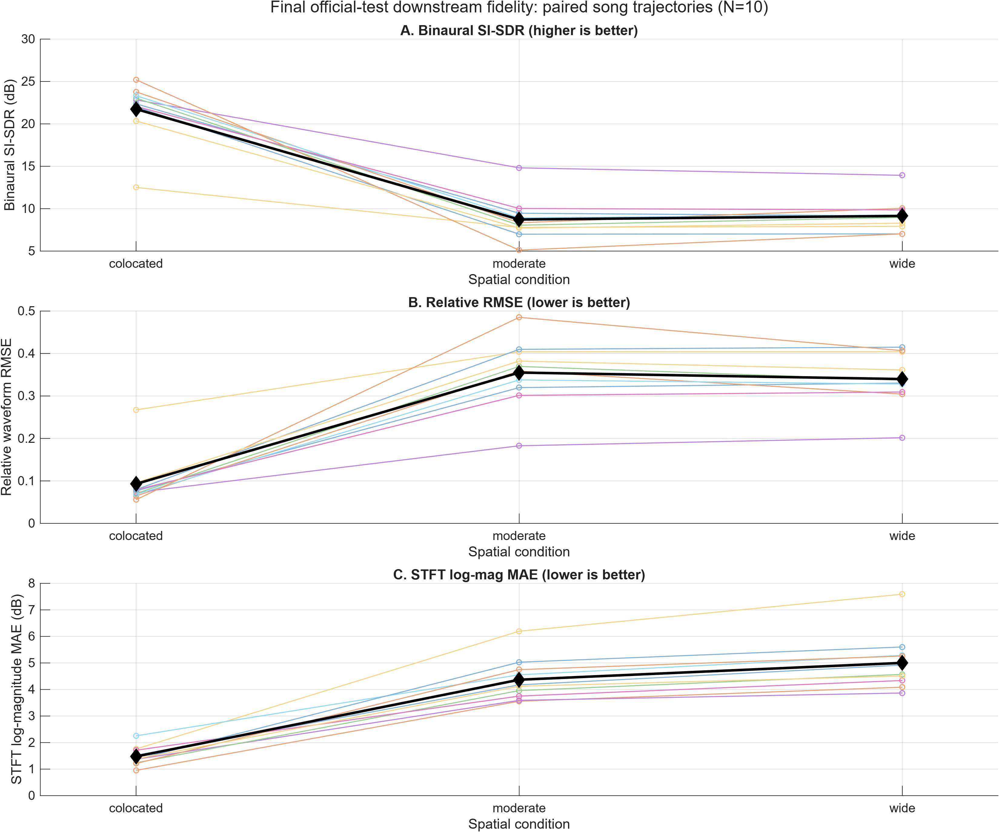
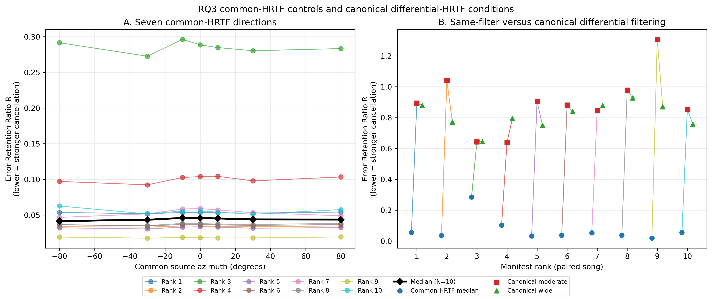
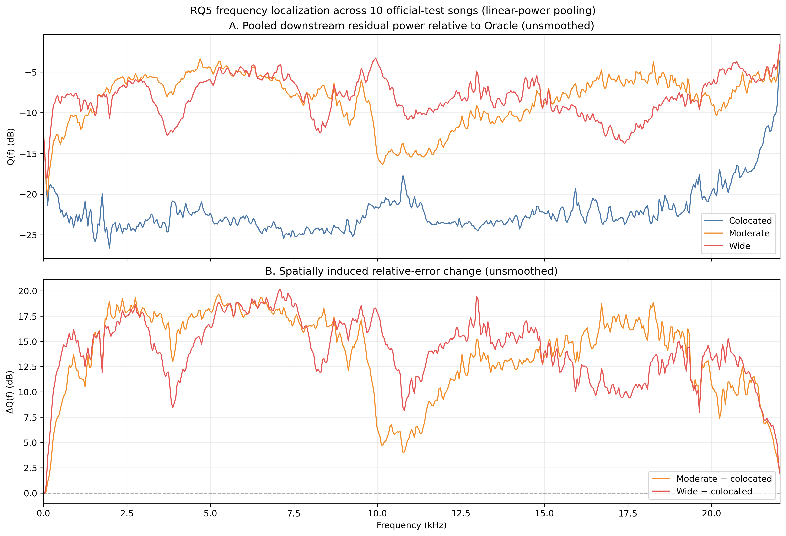
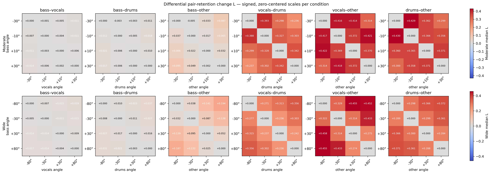

# Deep Learning-Assisted Dynamic Binaural Music Spatialisation

This ELEC5305 semester project investigates how deep-learning source separation can support a dynamic binaural music renderer for ordinary stereo recordings. The final system concept separates a song into vocals, drums, bass and other stems, renders each stem with an HRTF, and combines the results into a headphone-ready binaural mix.

The current repository contains a completed source-separation stage and a completed fixed-HRTF mechanism study. Dynamic trajectories, smooth HRTF transitions and the application/demo remain planned work. The Phase 2 study is therefore not a replacement for the original application goal: it establishes how separation errors behave after spatial rendering so that the later dynamic system can be designed and interpreted responsibly.

## Project Status

| Phase | Scope | Status |
|---|---|---|
| 1 | Source separation with official pretrained HTDemucs-FT | **Complete** |
| 2 | Fixed-HRTF rendering and separation-error mechanism study | **Complete through Phase 2.11** |
| 3 | Small cross-HRTF-subject robustness extension | **Planned** |
| 4 | Dynamic spatialisation, listening examples and lightweight demo/UI | **Planned** |

## Project Pipeline


## Why This Project Matters

Separating a finished stereo mix creates estimation errors in each stem. Those errors do not necessarily add independently: errors from different stems can partially cancel when the stems are summed. Spatialisation changes this interaction.

Let `e_j` be the separation error for stem `j`, and let `H_j` be its binaural HRTF filter. The downstream binaural error is

```text
D = Σ H_j e_j
```

When every stem uses the same filter, the errors are summed under a common linear transformation and much of their original cross-stem cancellation is preserved. When stems use different HRTFs, each error receives different spectral, phase and binaural weighting before summation. This weakens cancellation, so more separation error can remain in the final binaural mix. Phase 2 tests this controlled signal-processing mechanism before the project moves to dynamic rendering.

## Current Key Findings

- **The final separator is the official pretrained `htdemucs_ft` model.** On the completed 10-song Phase 1 validation set, its macro SI-SDR was **9.792 dB**. Earlier Open-Unmix experiments remain as development history, but no user training or fine-tuning is used in the final system.
- **Different per-stem HRTFs substantially increase downstream mismatch relative to colocated rendering.** Median binaural SI-SDR fell from **22.595 dB** when all stems were colocated to **8.198 dB** for the moderate spread and **9.055 dB** for the wide spread. The moderate-to-wide change is not consistently monotonic across all metrics.
- **The principal observed mechanism is reduced cross-stem error cancellation.** The Error Retention Ratio `R = T/A` compares total surviving error energy with the sum of individually rendered stem-error energies; lower `R` means stronger cancellation. Median `R` was **0.04590** for colocated rendering, compared with **0.88786** and **0.81703** for the canonical moderate and wide assignments.
- **Same-filter cancellation is robust across the seven tested HRTF directions.** Common-HRTF median `R` values occupied a narrow **0.04156–0.04594** range, while the differential-HRTF conditions remained much higher.
- **The direction of the mechanism is robust to source-position assignment.** All **480/480** tested differential-HRTF assignments retained more error than the matched song-level common-filter baseline. Assignment still changes the size of the effect.
- **Assignment sensitivity is song- and pair-dependent.** Interactions involving vocals, drums and other generally showed the largest differential pair changes; no single angular-separation rule explained every condition. Surviving relative error increased most clearly above approximately **500 Hz**, with strong mid/high-band effects.

These are objective signal-error results for the frozen sample, separator and HRTF subject. They do not establish perceived quality loss or localisation impairment; no formal listening study has yet been conducted. See the [Phase 2 documentation index](docs/phase2/README.md) for the full evidence and interpretation boundaries.

## Phase 1 — Source Separation

Phase 1 converts stereo music into independently spatialisable vocals, drums, bass and other stems. The selected separator is the official pretrained HTDemucs-FT four-model bag. The final 10-song validation macro SI-SDR was 9.792 dB, compared with 9.247 dB for standard pretrained HTDemucs and 6.337 dB for the retained best Open-Unmix baseline.

No separator is trained or fine-tuned in the final pipeline. The Python evaluation and cache tooling records fixed splits, model provenance, per-song completion state and signal-integrity checks. Phase 2 then uses the frozen HTDemucs-FT estimates rather than rerunning inference.

## Phase 2 — Fixed-HRTF Mechanism Study

Phase 2 uses 10 deterministically selected MUSDB18-HQ test songs, one fixed 30-second excerpt per song, CIPIC `subject_003`, and a validated full-linear-convolution renderer.

- **Effect:** oracle and estimated stems were rendered under colocated, moderate and wide spatial conditions. Differential per-stem rendering produced substantially greater objective downstream mismatch than colocated rendering.
- **Mechanism:** energy decomposition showed that colocated/common-filter processing preserves strong cross-stem cancellation, while differential filters retain much more of the individual stem errors.
- **Attribution and localisation:** exact four-stem Shapley attribution and stem-wise analyses identified interaction-aware contributions. Frequency analysis located the largest whole-mix relative-error increases mainly from 500 Hz to 20 kHz; this is not a perceptual audibility measure.
- **Robustness:** seven common-HRTF controls and all 24 assignments for each of two four-angle sets separated the same-filter effect from the chosen canonical mappings.
- **Assignment sensitivity:** Phase 2.11 decomposed assignment-dependent changes into own-error load and signed stem-pair interactions. The effect magnitude depends strongly on song-specific error composition.

## Representative Results



All 10 paired songs show worse objective downstream fidelity for moderate and wide differential-HRTF rendering than for colocated rendering. The figure reports SI-SDR, relative RMSE and STFT log-magnitude MAE; it does not imply that moderate-to-wide spread is uniformly monotonic.



Lower Error Retention Ratio indicates stronger cross-stem cancellation. Seven common-HRTF directions remain low, while canonical differential-HRTF conditions retain substantially more separation error for every song.



The largest spatially induced relative-error increases occur mainly above 500 Hz. These pooled objective spectra localise the residual energy; they are not loudness-weighted or perceptual thresholds.



Pair identity matters: vocals–other, drums–other and vocals–drums often show larger changes than bass-related pairs. The detailed pattern varies by condition and placement, so angular separation alone is not a complete explanation.

## Repository Structure

```text
config/phase2/       frozen manifests and experiment protocols
data/                local datasets and HRTF files (not stored in Git)
docs/phase2/         stage-by-stage methods, results and limitations
docs/feedback/       milestone summaries for teaching feedback
docs/assets/         small tracked copies of representative figures
scripts/evaluation/  Phase 1 separator evaluation
scripts/python/      metrics, aggregation and analysis
scripts/matlab/      reproducible HRTF/DSP experiment entry points
src/matlab/          reusable renderer and analysis functions
tests/               lightweight Python and MATLAB validation tests
outputs/             generated metrics, figures, audio and caches (ignored)
```

The [architecture note](docs/architecture.md) gives the current component boundary. The [Feedback 2 progress summary](docs/feedback/feedback_2_progress.md) provides a compact milestone view.

## Reproducing the Work

The Python environment is specified by [`environment.yml`](environment.yml) and [`requirements.txt`](requirements.txt). Python owns HTDemucs-FT inference, source metrics, aggregation and statistical analysis. MATLAB owns HRTF loading, convolution, binaural rendering and the core DSP/mechanism computations. The project does not claim a single-command full reproduction.

Local data must follow [`data/README.md`](data/README.md): MUSDB18-HQ under `data/musdb18hq/` and CIPIC `subject_003.sofa` under `data/hrtf/cipic/`. Large datasets, model caches, audio and generated outputs are intentionally not stored in Git.

Phase 2 is anchored by the frozen [`final_test_manifest.json`](config/phase2/final_test_manifest.json), [`static_experiment_protocol.json`](config/phase2/static_experiment_protocol.json), [`mechanism_analysis_protocol.json`](config/phase2/mechanism_analysis_protocol.json) and [`assignment_sensitivity_protocol.json`](config/phase2/assignment_sensitivity_protocol.json). Each detailed Phase 2 document records its real Python/MATLAB entry points, validation gates and report-ready outputs. Reproduction can be expensive, so existing valid caches are checked and reused; the documentation refresh did not rerun any experiment.

## Current Limitations

- 10-song fixed test subset with one 30-second excerpt per song.
- One final separator: official pretrained HTDemucs-FT.
- One HRTF subject in Phase 2: CIPIC `subject_003`.
- Fixed, discrete azimuth sets rather than continuous movement.
- No formal perceptual listening study; objective mismatch is not a perceptual percentage loss.

## Next Steps

**Phase 3 — Cross-HRTF Subject Robustness:** a small deterministic extension will test whether the core cancellation mechanism persists for a limited set of additional HRTF subjects. It is not intended to repeat the full Phase 2 study at publication scale.

**Phase 4 — Dynamic Spatialisation and Application:** implement time-varying stem trajectories, smooth HRTF transitions using crossfading or interpolation, binaural listening examples, and a lightweight demo/UI. Within the course-project scope, the priority is a clear and reliable end-to-end application.

## Course Context

University of Sydney, ELEC5305 semester project. The original [project proposal](project%20proposal.pdf) is retained for project context; this README reflects the later completed Phase 1 and Phase 2 work.
